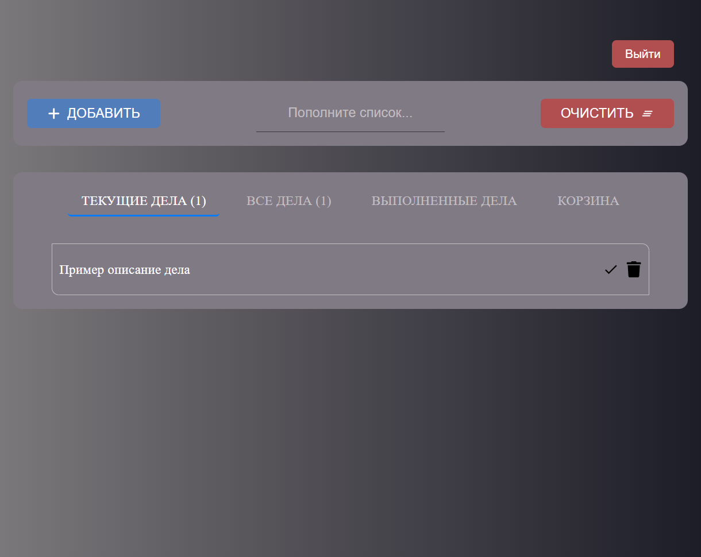
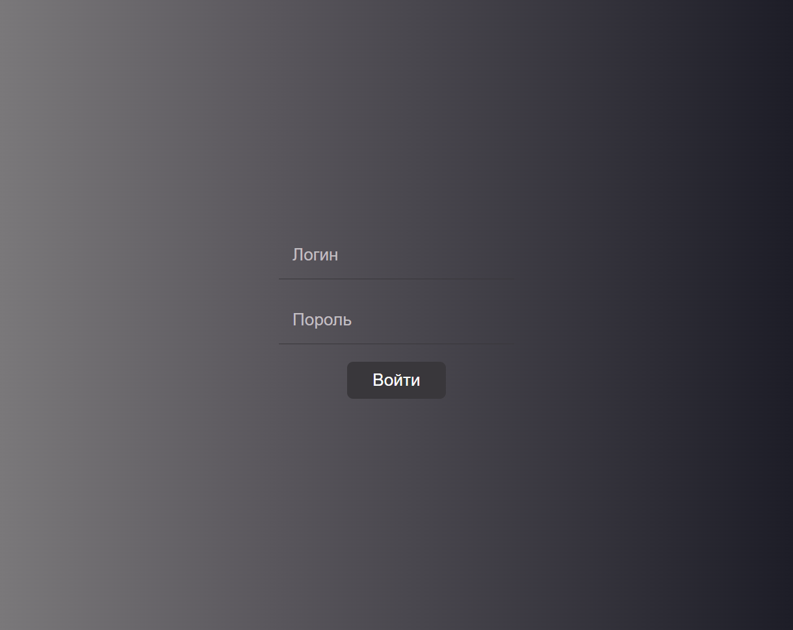
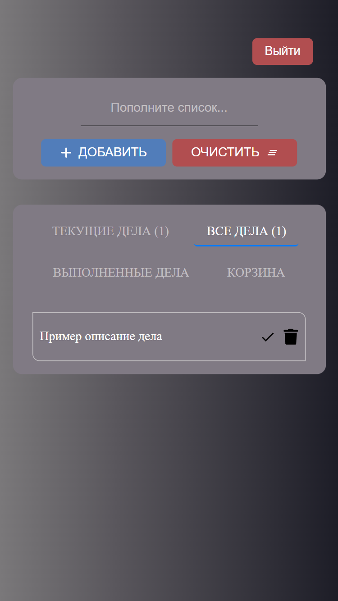
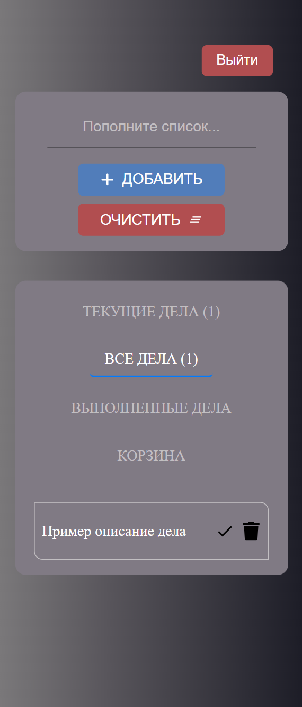

<h1 align="center">To Do List</h1>

Реализовать приложение mobile responsive 🚀 Techs

> - [React JS](https://reactjs.org/)
> - [TypeScript](https://www.typescriptlang.org/)
> - [SASS/SCSS](https://sass-lang.com/)
> - [Redux Toolkit](https://redux-toolkit.js.org/introduction/getting-started)

 

  
  

<!-- 

  
  

 -->

# Запуск проекта
- Клонировать репозиторий
  > git clone https://github.com/inacio000/todo-list.git

- Установить зависимости
  > npm start
  
  > cd todo-list
  
  > npm run dev
  
### [🔗Нажмите здесь, чтобы просмотреть сайт](https://todo-list-henna-delta.vercel.app/login)
